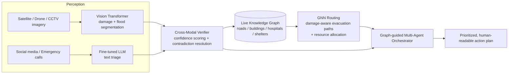

# ADIS Architecture

## Pipeline overview



## Code ↔ architecture mapping

| Architecture component | Module | Phase-0 implementation | Real implementation lands in |
|---|---|---|---|
| Vision perception agent | `adis.perception.vision.model.VisionDamageAgent` | deterministic mock | Phase 1 (fine-tuned ViT on xBD/FloodNet) |
| Text perception agent | `adis.perception.text.model.TextTriageAgent` | keyword-rule mock | Phase 1 (LoRA-fine-tuned LLM on CrisisNLP) |
| Cross-modal verifier | `adis.fusion.verifier.CrossModalVerifier` | confidence-weighted rule baseline | Phase 2 (learned verification agent) |
| Live knowledge graph | `adis.knowledge_graph.builder.KnowledgeGraphBuilder` | in-memory networkx graph, manual fixtures | Phase 3 (OSM ingestion via `osmnx`) |
| GNN routing | `adis.routing.router.EvacuationRouter` | Dijkstra baseline | Phase 3 (GraphSAGE/GAT via PyTorch Geometric) |
| Multi-agent orchestrator | `adis.orchestrator.pipeline.ADISPipeline` | fixed function-pipeline | Phase 4 (LangGraph agentic graph) |
| Serving layer | `adis.api.main` (`POST /analyze`) | FastAPI, one-shot in-memory graph per request | Phase 4 (persistent graph, streaming ingestion) |

## Example `/analyze` request payload

```json
{
  "hq_node": "HQ",
  "intersections": ["HQ", "N1", "N2", "N3"],
  "roads": [
    {"location_id": "road_hq_n1", "node_a": "HQ", "node_b": "N1", "length_km": 2.0},
    {"location_id": "road_n1_n2", "node_a": "N1", "node_b": "N2", "length_km": 1.5}
  ],
  "facilities": [
    {"location_id": "hospital_1", "node_type": "hospital", "name": "City Hospital", "nearest_intersection": "N2"}
  ],
  "vision_inputs": [
    {"image_path": "satellite_hospital_1.png", "location_id": "hospital_1", "source": "satellite"}
  ],
  "text_inputs": [
    {"text": "People trapped, need rescue near hospital", "location_id": "hospital_1", "source": "emergency-call"}
  ]
}
```

Response: `{"action_plan_text": "...", "items": [{"priority": 1, "location_id": "hospital_1", "action": "...", "rationale": "..."}]}`
